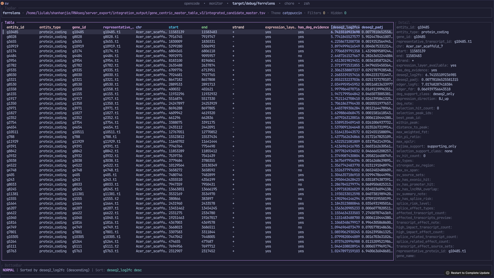

# ferrolens 0.1.0

`ferrolens 0.1.0` is the first public-facing release of a terminal-first review tool for bioinformatics result tables.

## Highlights

- Review `csv`, `tsv`, `txt`, `vcf`, and `vcf.gz` files from the terminal
- Navigate wide tables with column focus and horizontal panning
- Search, filter, sort, reset, hide columns, and export current visible rows
- Use a compact detail pane for fuller field content without sacrificing table readability
- Run with a Catppuccin Mocha theme tuned for SSH-heavy workflows

## Screenshot



## Best fit

This release is best suited for small-to-medium result tables and community preview use. It is already useful for real work, but still early in packaging, compatibility breadth, and large-file strategy.

## Known limitations

- Large-file handling is still memory-first
- CSV/TSV edge-case coverage still needs more real-world fixtures
- No BAM visualization or complex modal workflow yet

## Installation

Current recommended installation path is from source:

```bash
git clone https://github.com/H3dger/ferrolens.git ferrolens
cd ferrolens
cargo run -- --help
```

Planned follow-up distribution targets:

- `cargo install ferrolens`
- GitHub Releases with prebuilt Linux/macOS binaries

## Suggested GitHub release blurb

`ferrolens 0.1.0` is an early public release of a terminal-first review tool for bioinformatics result tables. It is aimed at researchers who work over SSH and need a fast, table-first way to inspect wide TSV/CSV outputs and VCF-derived result files without leaving the terminal.

## Feedback goals for 0.1.x

- Real-world TSV/CSV compatibility feedback
- Performance observations on medium and larger tables
- Workflow feedback on search/filter/sort/export ergonomics
